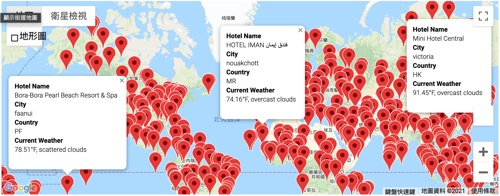
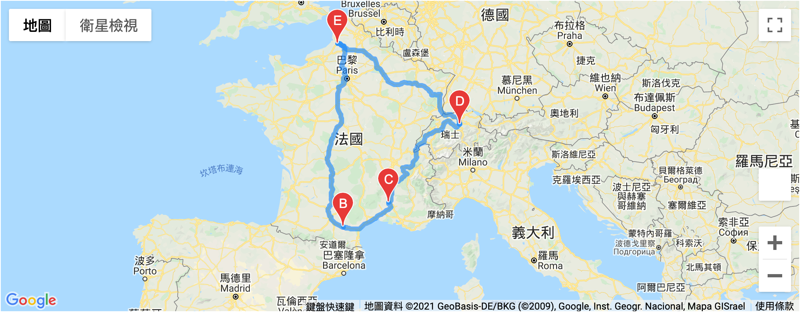
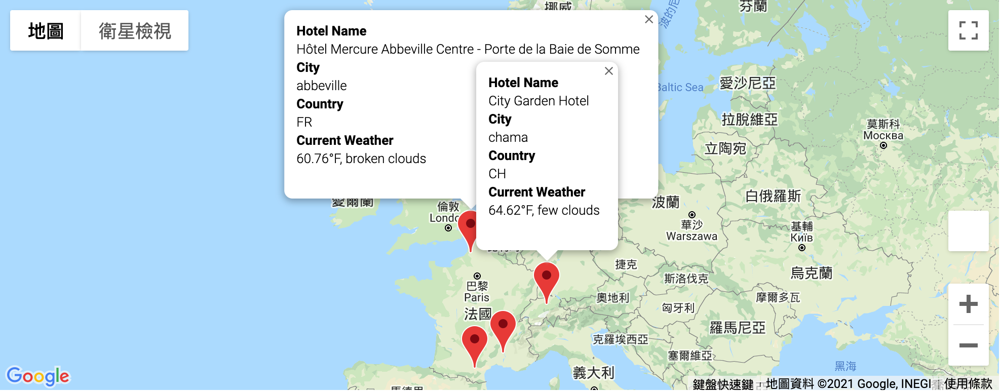

# World_Weather_Analysis
Help PLANMYTRIP, a travel technology company that specialize in internet related services in the hotel and loding industry to collect and present for customer via the search page. Which will then filter based on their preferred travel criteria in order to find their ideal hotel anywhere in the world. 
1. Within a given range of latitude and longitude 
2. Provided the right kind of weather and hotel for the client

## Project Overview
- Deliverable 1: Retrieve Weather Data  
Generate a set of 2,000 random latitudes and longitudes, retrieve the nearest city, and perform an API call with the OpenWeatherMap. In addition to the city weather data you gathered in this module, use your API skills to retrieve the current weather description for each city. Then, create a new DataFrame containing the updated weather data.  
<a href = "https://github.com/angelnga/World_Weather_Analysis/blob/main/Weather_Database/WeatherPy_Database.csv">  WeatherPy_Database.csv </a>

- Deliverable 2: Create a Customer Travel Destinations Map 
Use input statements to retrieve customer weather preferences, then use those preferences to identify potential travel destinations and nearby hotels. Then, show those destinations on a marker layer map with pop-up markers. 
<a href = "https://github.com/angelnga/World_Weather_Analysis/blob/main/Vacation_Search/WeatherPy_vacation.csv">  WeatherPy_vacation.csv </a>

- Deliverable 3: Create a Travel Itinerary Map 
Use the Google Directions API to create a travel itinerary that shows the route between four cities chosen from the customer’s possible travel destinations. Then, create a marker layer map with a pop-up marker for each city on the itinerary.

